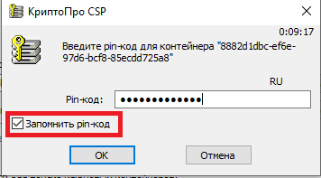
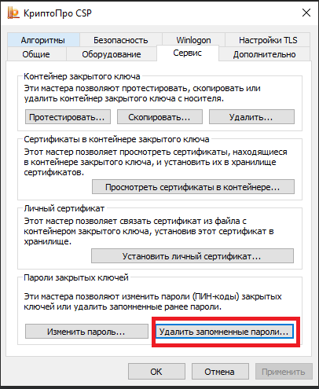
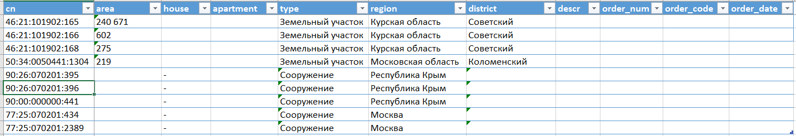

= Бот для заказа (УСТАРЕЛО) и скачивания (АКТУАЛЬНО) выписок из ЕГРН
2021-07-04

image:doc/img/icon.png[Баран]

____
Хороший пастух, если захочет, и от барана масло получит

—  Армянская пословица
____

[WARNING]
====
30.10.2021 Росреестр предложил значительно усовершенствованный интерфейс для заказа выписок из ЕГРН, а старый интерфейс отключил.
Следовательно, бот разучился заказывать выписки, но с новым интерфейсом это теперь и не нужно.

Скачивать выписки в новых условиях бот обучен.
====

[[_назначение_бота]]
== Назначение бота

Бот заказывает и *скачивает* выписки из Единого государственного реестра
недвижимости (ЕГРН) вместо пользователя. При этом он практически не
мешает пользоваться компьютером и браузером во время своей работы.

Бот предназначен для работников органов государственной власти, органов
местного самоуправления и юридических лиц, которые:

* имеют право на бесплатное получение сведений из ЕГРН;
* работают в организациях, которые не способны организовать
взаимодействие с Росреестром через его веб-сервисы;
* нуждаются в заказе не менее 3 выписок (иначе заказ проще вручную
сделать).

Для всех остальных рекомендую использовать
https://spv.kadastr.ru[Сервис] предоставления сведений ФГБУ «ФКП
Росреестра» или
https://rosreestr.gov.ru/wps/portal/p/cc_present/ir_egrn[ФГИС ЕГРН].

[[скачать_бота]]
== Загрузка бота на компьютер

Существует несколько способов загрузки бота:

* Если на компьютере установлена система контроля версий
https://www.mercurial-scm.org/downloads[Mercurial] (_Предпочтительно_):
[arabic]
. Запустите командную строку и перейдите в каталог, в котором
планируется разместить бот;
. Выполните команду:
+
[source,shell]
----
hg clone http://hg.code.sf.net/p/cadaster-utils/extract-order extract-order
----
* Если на компьютере установлена система контроля версий
https://git-scm.com/download/win[Git]:
[arabic]
. Запустите командную строку и перейдите в каталог, в котором
планируется разместить бот;
. Выполните команду:
+
[source,shell]
----
git clone --depth 1 https://github.com/gmaFFFFF/extract-order extract-order
----
* Если систем контроля версий нет, то скачайте файл по
https://github.com/gmaFFFFF/extract-order/archive/refs/heads/develop.zip[ссылке]
и распакуйте его в нужный каталог.

[[_установка_и_настройка_windows]]
== Установка и настройка (Windows)

Установите на рабочем компьютере:

[arabic]
. Браузер Opera версии 76.0.4017.177 — для взаимодействия с порталом
Росреестра:
* Поддерживаемая версия Opera доступна по
https://get.opera.com/pub/opera/desktop/76.0.4017.177/win/[ссылке].
Разрядность браузера Opera
(https://get.opera.com/pub/opera/desktop/76.0.4017.177/win/Opera_76.0.4017.177_Setup.exe[x86]
или
https://get.opera.com/pub/opera/desktop/76.0.4017.177/win/Opera_76.0.4017.177_Setup_x64.exe[x64])
выбирайте в соответствии с разрядностью операционной системы.
+
[CAUTION]
====
Чтобы избежать автообновления необходимо загрузить файл, не содержащий в
названии «Autoupdate».
====
* Opera необходимо установить в папку C:/Program Files или C:/Program
Files (x86). Для этого после запуска установки Opera нажмите «Настройки»
и в поле «Установить для» выберите «Для всех пользователей»;
. Последнюю версию
https://www.python.org/downloads/windows[Python] — для выполнения
исходного кода бота.
. https://www.cryptopro.ru/system/files/private/csp/50/11998/CSPSetup-5.0.11998.exe[Крипто
Про CSP] — для работы с электронной подписью (ЭЦП) по ГОСТ;
. https://www.cryptopro.ru/products/cades/plugin[КриптоПро ЭЦП Browser
plug-in] — для использования функционала Крипто Про CSP в браузерах;
. КриптоПро ЭЦП Browser plug-in для браузера Opera согласно
https://docs.cryptopro.ru/cades/plugin/plugin-installation-windows[инструкции] — для
включения возможности plug-in’а в браузере Opera.

Настройка программ для работы с электронной подписью (ЭЦП):

[arabic]
. Установите свой сертификат ЭЦП с помощью КриптоПро CSP. Множество
https://www.yandex.ru/search/?text=Установка%20сертификата%20подписи%20через%20КриптоПро%20CSP[инструкций]
можно найти в Интернете.
. Настройте ЭЦП Browser Plug-in, добавив портал Росреестра
(https://*.rosreestr.gov.ru) в «Список доверенных узлов». Для открытия
окна настроек выполните: Пуск – КриптоПРО – Настройки ЭЦП Browser
Plug-in.

Подготовка браузера для продуктивной работы:

[arabic]
. Установите менеджер паролей или форм, например,
https://www.roboform.com/ru/download[RoboForm].
. Закажите одну выписку из ЕГРН вручную
https://rosreestr.gov.ru/wps/portal/p/cc_present/EGRN_1[на портале]
Росреестра, при этом:
* Сохраните в менеджере паролей информацию о лице, заказывающем выписки,
что позволит Вам впоследствии существенно сократить время на запуск
бота.
* Подтвердите сохранение ПИН-кода к ЭЦП (иначе при работе бота Вам
придётся вводить его вручную);
+

+
[TIP]
====
Для сброса сохраненного ПИН-кода из памяти компьютера воспользуйтесь
приложением КриптоПро CSP.

====
* Во всех всплывающих окнах, запрашивающих разрешение на совершение
действий с ЭЦП, подтвердите сохранение своего выбора для следующих раз
(иначе во время работы бота Вам придётся делать это вручную);
* Убедитесь, что, если на одну фамилию имеется несколько ЭЦП, то ЭЦП для
подписания на сайте Росреестра расположена в списке первой.

Настройка бота:

[arabic]
. Запустите файл install_venv.bat, расположенный в основной директории
бота, для создания виртуальной среды окружения Python, которая защитит
Вашу операционную систему от конфликтов между различными библиотеками
Python;
. Приступайте к работе.

[[_что_делать_если_нельзя_установить_python]]
=== Что делать, если нельзя установить Python?

Существует способ создания переносимой версии бота, но для этого
всё-таки нужен компьютер с Python, но зато только один.

[NOTE]
====
Данный способ не отменяет необходимость установки и настройки браузера
Opera и программ для работы с ЭЦП на пользовательских компьютерах.
====

Выполните следующие шаги на отдельном компьютере, предназначенном для
сборки приложения:

[arabic]
. Установите последнюю версию
https://www.python.org/downloads/windows[Python];
. link:#скачать_бота[Скачайте] бота;
. Запустите файл build_portable.bat, расположенный в основной директории
бота;
. Из каталога distr заберите папку бота и распространите её любым
удобным способом на компьютерах конечных пользователей.

[[_известные_проблемы_с_установкой]]
=== Известные проблемы с установкой

[[_запуск_файла_install_venv_bat_заканчивается_неудачно]]
==== Запуск файла install_venv.bat заканчивается неудачно

Вы видите сообщение, что не удалось разрешить зависимости:

....
Locking [dev-packages] dependencies...
 Locking...Building requirements...
Resolving dependencies...
Locking Failed!
....

Прежде всего попробуйте перезагрузить компьютер.

Если перезагрузка не помогла, то одной из возможных причин являются
ограничения, наложенные администратором сети, вызывающие невозможность
проверить SSL сертификат хранилища пакетов Python.

Для решения этой проблемы Вам потребуется компьютер, не связанный
указанными ограничениями:

[arabic]
. Установите на нём последнюю версию
https://www.python.org/downloads/windows[Python];
. link:#скачать_бота[Скачайте] на него бот;
. Запустите файл install_venv.bat, расположенный в основной директории
бота, для создания виртуальной среды окружения Python, которая защитит
Вашу операционную систему от конфликтов между различными библиотеками
Python;
. В папке бота запустите командную строку и выполните команду:
+
[source,shell]
----
pipenv lock --requirements > requirements.txt
----
. Созданный файл requirements.txt перенесите на целевой (рабочий)
компьютер в папку бота;

На рабочем компьютере в папке бота:

[arabic]
. Модифицируйте файл install_venv.bat, закомментировав строку (добавьте
в её начале слово _rem_ и пробел)
+
[source,shell]
----
set trustedHostParam=
----
. Запустите файл install_venv.bat
. Запустите командную строку и выполните команду:
+
[source,shell]
----
pipenv run pip install --trusted-host pypi.org --trusted-host pypi.python.org --trusted-host files.pythonhosted.org -r requirements.txt
----

[[_инструкция_по_использованию]]
== Инструкция по использованию

[[_заказ_выписок]]
=== Заказ выписок

[[_ограничения]]
==== Ограничения

[arabic]
. Бот иногда «вылетает». Это связано с нестабильной работой сайта
Росреестра;
. На заказ одной выписки бот тратит около 3 минут, чтобы «вылетать»
реже…​

[[_подготовка_исходных_данных]]
==== Подготовка исходных данных

[[_формирование_файла_заказа]]
===== Формирование файла заказа

Чтобы бот узнал, на какие объекты необходимо заказать сведения,
пользователю необходимо сформировать файл заказа. Файл заказа называется
orders.xlsx, находится в корне приложения и является обычным файлом
Excel.

При заполненни файла заказа необходимо учитывать:

* По некоторым регионам (например, я знаю про Москву и Крым) поле района
должно остаться пустым.
* Названия региона и района должны соответствовать внутренним
классификаторам Росреестра.
* Файл заказа содержит справочник регионов и районов, извлеченных с
сайта Росреестра, поэтому для сокращения числа ошибок используйте
выпадающий список, но всё равно *сверяйтесь* с порталом Росреестра.
* Excel берет на себя задачу определения региона и района по
кадастровому номеру объекта. К сожалению результат его работы требует
*обязательной* проверки. Ошибки могут быть связаны, в том числе с
изменением границ регионов, например, между Москвой и Московской
областью, когда первые цифры кадастрового номера (обозначающие регион)
остаются без изменения, но объект фактически располагается в другом
регионе.

Пример содержимого файла orders.xlsx:

Во время работы бота не следует открывать файл заказа, так как Excel
помешает боту читать и записывать его данные. Чтение происходит один раз
после запуска бота, а запись на каждом последнем шаге заказа (когда
портал Росреестра возвращает номер заказа и код).

[IMPORTANT]
====
Если Вы запишите новые данные в файл заказа в промежутках когда бот его
не использует, то в момент записи данных об очередном заказе все Ваши
изменения будут отброшены.
====

При повторном запуске бот не будет перезаказывать выписки на объекты, по
которым есть информация о номере заказа. Поэтому файл заказа можно
использовать для ведения реестра выписок, заказанных вручную.

[[_запуск_бота_заказа_выписок]]
==== Запуск бота заказа выписок

[arabic]
. Если Вы недавно делали заказ выписок из ЕГРН
https://rosreestr.gov.ru/wps/portal/p/cc_present/EGRN_1[на сайте]
Росреестре, то убедитесь, что он открывается на первом шаге.
. Закройте браузер Opera, иначе получите ошибку при запуске бота.
. Запустите файл start_order.bat.
. Бот откроет браузер Opera и начнет вводить данные заказа.
. Дождитесь появления сообщения в консоли «Заполните первую страницу и
нажмите Enter…​»
+
image:doc/img/step1_cmd.png[Бот ждёт от пользователя заполнения 1 шага
заказа]
. Заполните e-mail и решите капчу на 1 шаге в окне браузера.
+
image:doc/img/step1_browser.png[Пользователь вводит необходимые данные
на 1 шаге заказа]
. Нажмите в консоли Enter.
. Дождитесь появления сообщения в консоли «Заполните вторую страницу и
нажмите Enter…​»
+
image:doc/img/step2_cmd.png[Бот ждёт от пользователя заполнения 2 шага
заказа]
. Заполните данные о заявителе на 2 шаге в окне браузера.
+
image:doc/img/step2_browser.png[Пользователь вводит необходимые данные
на 2 шаге заказа]
. Нажмите в консоли Enter.
. Дождитесь появления сообщения в консоли «Заполните третью страницу и
нажмите Enter…​»
+
image:doc/img/step3_cmd.png[Бот ждёт от пользователя заполнения 3 шага
заказа]
. Подгрузите документы на 3 шаге в окне браузера.
+
image:doc/img/step3_browser.png[Пользователь вводит необходимые данные
на 3 шаге заказа]
+
[TIP]
====
Я не подгружаю никакие документы, но выписки мне приходят.
====
. Нажмите в консоли Enter.
. Дальше бот будет заказывать выписки по всем объектам из файла
orders.xlsx, по которым нет номера заказа.

Если бот «вылетел», то повторите процедуру с 1 шага.

[TIP]
====
Если Вы только что делали заказ выписки из ЕГРН и портал Росреестра
сохранил введенные данные, то при появлении сообщения в консоли
«Заполните первую страницу и нажмите Enter…​» нажмите Enter 3 раза. Бот
без Вашего участия пройдет 2 и 3 шаг. Так Вы сэкономите немного времени.
====

[[_скачивание_выписок]]
=== Скачивание выписок

Готовые выписки можно скачать двумя способами:

[arabic]
. С сайта Росреестра, решив капчу и введя код заказа;
. Нажав на ссылку в письме Росреестра с темой «Уведомление о завершении
обработки запроса».

Бот обучен только второму способу и только с помощью Microsoft Outlook.

[NOTE]
====
Росреестр не был бы так горячо любим, если бы письма с темой
«Уведомление о завершении обработки запроса» приходили всегда. К счастью
они приходят чаще всего (по моим объектам в 80% случаев). Видимо у
Росреестра для балансировки нагрузки стоит некорректно настроенный
сервер, который и не рассылает такие письма. Поэтому у Вас всегда
останется возможность занять себя на работе вводом кода и решением
капчи. А в качестве «вишенки на торте» в этом случае выписки получают
странное расширение xml.original, что позволит Росреестру также развлечь
Вас их переименованием. Что может быть интереснее?
====

Порядок работы с ботом:

[arabic]
. Откройте Microsoft Outlook и дождитесь завершения процедуры получения
почты.
. Перейдите в папку, в которую попадают письма от Росреестра.
Стандартно — это папка «Входящие», но как правило многие с помощью
«Правил Outlook» или почтового сервера настраивают отдельную папку для
сообщений Росреестра, например, у меня она называется «Росреестр».
. Письма, которые бот будет обрабатывать должны быть непрочитанными.
Если Вы случайно прочитали такое сообщение, то с помощью кнопки
«Прочитано» в панели тегов можете вновь сделать сообщение непрочитанным.
+
image:doc/img/outlook_view.png[Общий вид окна MS Outlook]
. Запустите файл start_download.bat.
. Система безопасности Outlook может попросить подтвердить разрешение на
доступ к данным электронной почты. Без указанного разрешения бот не
сможет работать.
+
image:doc/img/outlook_security.png[Общий вид окна MS Outlook]
. Бот загрузит выписки в папку extracts-downloaded на рабочем столе.

Если Вы желаете изменить папку загрузки выписок, то исправьте название
каталога (%userprofile%\desktop\extracts-downloaded) в файле
start_download.bat на более подходящее:

[source,shell]
----
set target=%userprofile%\desktop\extracts-downloaded
----

[[_связанные_проекты]]
== Связанные проекты

[arabic]
. https://github.com/gmaFFFFF/extract-renamer[Переименовыватель] выписок
из ЕГРН.
. https://github.com/gmaFFFFF/extract2shp[Конвертер] выписок из ЕГРН в
формат Esri Shape и sql insert.
. https://plan-kpt-xml2html.sourceforge.io/plan-kpt-xml2html.xhtml[Онлайн]
конвертер xml схем расположения земельного участка или земельных
участков на кадастровом плане территории в человекочитаемый вид.
. https://github.com/gmaFFFFF/land-management-contracts[Шаблоны]
договоров и технических заданий по землеустройству в формате AsciiDoc.
. https://github.com/gmaFFFFF/realty-db-in-excel[База данных]
недвижимости в Excel.
. https://github.com/gmaFFFFF/cadaster-parcel-descr-dwg[Описание
земельного участка] — программа подготовки графической части описания
земельного участка для выполнения кадастровых работ (устарело).
. https://github.com/gmaFFFFF/shubich-vo-imja-zhizni/releases[«Во имя
жизни»] (автобиографическая повесть) проф. землеустройства М.П. Шубича.

[[_перспективы_развития]]
== Перспективы развития

Для полноценной работы боту очень не хватает следующего функционала:

[arabic]
. Заполнение 2 шага ботом на основе предварительно сохраненных данных,
например, в файле orders.xlsx;
[loweralpha]
.. В качестве бонуса это поможет избавиться от необходимости запускать
браузер с профилем текущего пользователя;
. Заказ КПТ;
. Решение капчи самостоятельно или с подключением к специализированным
сервисам;
. «Умное» взаимодействие с порталом Росреестра:
[loweralpha]
.. Понимание, что портал «выкинул» пользователя;
.. Повторная авторизация;
.. Ожидание пока сервер «лежит» (он делает это очень часто);
.. Увеличение скорости ввода данных.

К сожалению автор прекратил развитие бота…​

Теоретически, так как бот распространяется с открытой лицензией, то
любое заинтересованное лицо может его доработать. С практической точки
зрения не стоит на это даже надеяться. Область применения бота слишком
узкая, для того чтобы нашлось заинтересованное лицо, готовое тратить на
этот проект свои ресурсы.

[[_условия_распространения_бота]]
== Условия распространения бота

Бот распространяется под открытой лицензией MIT.

Если кратко, то это означает, что Вы можете пользоваться ботом, улучшать
его и, если сможете, то даже продавать его. При этом автор не несёт ни
за что никакой ответственности, всё на Ваш страх и риск. Условия
лицензии содержатся в файле license.txt, расположенном в корневом
каталоге бота.

Популярное объяснение условий лицензии можно почитать
https://habr.com/ru/post/310976/[здесь].
