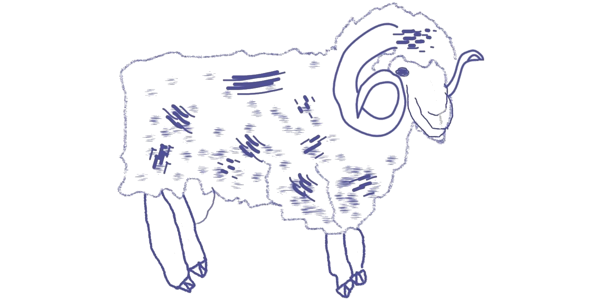
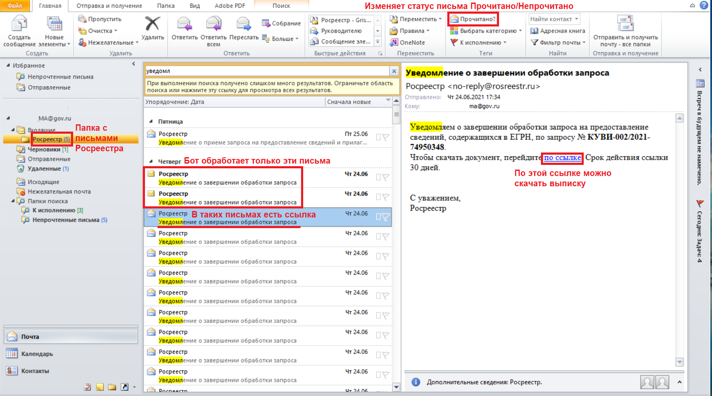
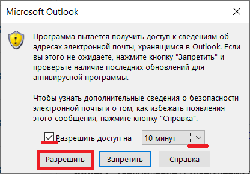

= Бот для заказа и скачивания выписок из ЕГРН
2022-10-20

____
Хороший пастух, если захочет, и от барана масло получит

—  Армянская пословица
____

[WARNING]
====
30.10.2021 Росреестр предложил значительно усовершенствованный интерфейс
для заказа выписок из ЕГРН, а старый интерфейс отключил. Следовательно,
бот разучился заказывать выписки, но с новым интерфейсом это теперь и не
нужно.

Скачивать выписки в новых условиях бот обучен.

Устаревший функционал заказа выписок не стал «выпиливать», но обновил
документацию.
====

[[_назначение_бота]]
== Назначение бота

Бот больше не заказывает выписки из Единого государственного реестра
недвижимости (ЕГРН), но по-прежнему *скачивает* их вместо пользователя.

[[скачать_бота]]
== Загрузка бота на компьютер

Существует несколько способов загрузки бота:

* Если на компьютере установлена система контроля версий
https://www.mercurial-scm.org/downloads[Mercurial] (_Предпочтительно_):
[arabic]
. Запустите командную строку и перейдите в каталог, в котором
планируется разместить бот;
. Выполните команду:
+
[source,shell]
----
hg clone http://hg.code.sf.net/p/cadaster-utils/extract-order extract-order
----
* Если на компьютере установлена система контроля версий
https://git-scm.com/download/win[Git]:
[arabic]
. Запустите командную строку и перейдите в каталог, в котором
планируется разместить бот;
. Выполните команду:
+
[source,shell]
----
git clone --depth 1 https://github.com/gmaFFFFF/extract-order extract-order
----
* Если систем контроля версий нет, то скачайте файл по
https://github.com/gmaFFFFF/extract-order/archive/refs/heads/develop.zip[ссылке]
и распакуйте его в нужный каталог.

[[_установка_и_настройка_windows]]
== Установка и настройка (Windows)

Установите на рабочем компьютере последнюю версию
https://www.python.org/downloads/windows[Python] — для выполнения
исходного кода бота.

Настройка бота:

[arabic]
. Запустите файл install_venv.bat, расположенный в основной директории
бота, для создания виртуальной среды окружения Python, которая защитит
Вашу операционную систему от конфликтов между различными библиотеками
Python;
. Приступайте к работе.

[[_что_делать_если_нельзя_установить_python]]
=== Что делать, если нельзя установить Python?

Существует способ создания переносимой версии бота, но для этого
всё-таки нужен компьютер с Python, но зато только один.

Выполните следующие шаги на отдельном компьютере, предназначенном для
сборки приложения:

[arabic]
. Установите последнюю версию
https://www.python.org/downloads/windows[Python];
. link:#скачать_бота[Скачайте] бота;
. Запустите файл build_portable.bat, расположенный в основной директории
бота;
. Из каталога distr заберите папку бота и распространите её любым
удобным способом на компьютерах конечных пользователей.

[[_известные_проблемы_с_установкой]]
=== Известные проблемы с установкой

[[_запуск_файла_install_venv_bat_заканчивается_неудачно]]
==== Запуск файла install_venv.bat заканчивается неудачно

Вы видите сообщение, что не удалось разрешить зависимости:

....
Locking [dev-packages] dependencies...
 Locking...Building requirements...
Resolving dependencies...
Locking Failed!
....

Прежде всего попробуйте перезагрузить компьютер.

Если перезагрузка не помогла, то одной из возможных причин являются
ограничения, наложенные администратором сети, вызывающие невозможность
проверить SSL сертификат хранилища пакетов Python.

Для решения этой проблемы Вам потребуется компьютер, не связанный
указанными ограничениями:

[arabic]
. Установите на нём последнюю версию
https://www.python.org/downloads/windows[Python];
. link:#скачать_бота[Скачайте] на него бот;
. Запустите файл install_venv.bat, расположенный в основной директории
бота, для создания виртуальной среды окружения Python, которая защитит
Вашу операционную систему от конфликтов между различными библиотеками
Python;
. В папке бота запустите командную строку и выполните команду:
+
[source,shell]
----
pipenv lock --requirements > requirements.txt
----
. Созданный файл requirements.txt перенесите на целевой (рабочий)
компьютер в папку бота;

На рабочем компьютере в папке бота:

[arabic]
. Модифицируйте файл install_venv.bat, закомментировав (добавьте в её
начале слово _rem_ и пробел) или удалив строку
+
[source,shell]
----
set trustedHostParam=
----
. Запустите файл install_venv.bat
. Запустите командную строку и выполните команду:
+
[source,shell]
----
pipenv run pip install --trusted-host pypi.org --trusted-host pypi.python.org --trusted-host files.pythonhosted.org -r requirements.txt
----

[[_инструкция_по_использованию]]
== Инструкция по использованию

[[_скачивание_выписок]]
=== Скачивание выписок

Готовые выписки можно скачать двумя способами:

[arabic]
. С сайта Росреестра, зайдя в личный кабинет;
. Нажав на ссылку в письме Росреестра с темой «Уведомление о завершении
обработки запроса».

Бот обучен только второму способу и только с помощью Microsoft Outlook.

[NOTE]
====
Росреестр не был бы так горячо любим, если бы письма с темой
«Уведомление о завершении обработки запроса» приходили всегда. К счастью
сейчас они приходят практически всегда (по моим объектам в 99% случаев).
====

Порядок работы с ботом:

[arabic]
. Откройте Microsoft Outlook и дождитесь завершения процедуры получения
почты.
. Перейдите в папку, в которую попадают письма от Росреестра.
Стандартно — это папка «Входящие», но как правило многие с помощью
«Правил Outlook» или почтового сервера настраивают отдельную папку для
сообщений Росреестра, например, у меня она называется «Росреестр».
. Письма, которые бот будет обрабатывать должны быть непрочитанными.
Если Вы случайно прочитали такое сообщение, то с помощью кнопки
«Прочитано» в панели тегов можете вновь сделать сообщение непрочитанным.
+

. Запустите файл start_download.bat.
. Система безопасности Outlook может попросить подтвердить разрешение на
доступ к данным электронной почты. Без указанного разрешения бот не
сможет работать.
+

. Бот загрузит выписки в папку extracts-downloaded на рабочем столе.

Если Вы желаете изменить папку загрузки выписок, то исправьте название
каталога (%userprofile%\desktop\extracts-downloaded) в файле
start_download.bat на более подходящее:

[source,shell]
----
set target=%userprofile%\desktop\extracts-downloaded
----

[[_связанные_проекты]]
== Связанные проекты

[arabic]
. https://github.com/gmaFFFFF/extract-renamer[Переименовыватель] выписок
из ЕГРН.
. https://github.com/gmaFFFFF/extract-converter[Конвертер] выписок из
ЕГРН в формат Esri Shape и sql insert.
. https://plan-kpt-xml2html.sourceforge.io/plan-kpt-xml2html.xhtml[Онлайн]
конвертер xml схем расположения земельного участка или земельных
участков на кадастровом плане территории в человекочитаемый вид.
. https://github.com/gmaFFFFF/land-management-contracts[Шаблоны]
договоров и технических заданий по землеустройству в формате AsciiDoc.
. https://github.com/gmaFFFFF/cadaster-parcel-descr-dwg[Описание
земельного участка] — программа подготовки графической части описания
земельного участка для выполнения кадастровых работ (устарело).
. https://github.com/gmaFFFFF/shubich-vo-imja-zhizni/releases[«Во имя
жизни»] (автобиографическая повесть) проф. землеустройства М.П. Шубича.

[[_перспективы_развития]]
== Перспективы развития

Развитие бота завершено.

[[_условия_распространения_бота]]
== Условия распространения бота

Бот распространяется под открытой лицензией MIT.

Если кратко, то это означает, что Вы можете пользоваться ботом, улучшать
его и, если сможете, то даже продавать его. При этом автор не несёт ни
за что никакой ответственности, всё на Ваш страх и риск. Условия
лицензии содержатся в файле license.txt, расположенном в корневом
каталоге бота.

Популярное объяснение условий лицензии можно почитать
https://habr.com/ru/post/310976/[здесь].
